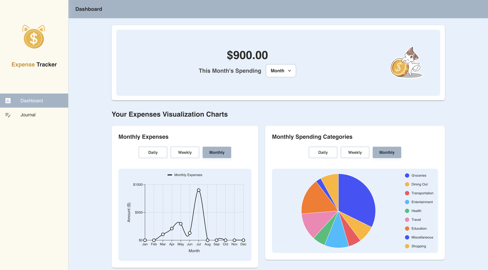

# 💰 Expense Tracker App

A simple and intuitive expense tracking application to help you manage your daily, weekly, and monthly spending. This app allows users to categorize their expenses, view recent transactions, and visualize spending trends over time.

## Team Members

- Khin Yadanar Moe - 6612128
- Aye Myat Myat Mon - 6611944
- Nattasasi Nithiworanan - 6610918

## Screenshots

### 📊 Dashboard - Monthly Summary & Charts

### 🧾 Journal - Add and View Expenses

## Features

- Track spending trends with daily, weekly, and monthly charts
- Monthly spending summary

- Add expenses by category
- View a list of recent transactions with date, category, description, and amount
- Add custom expense category
